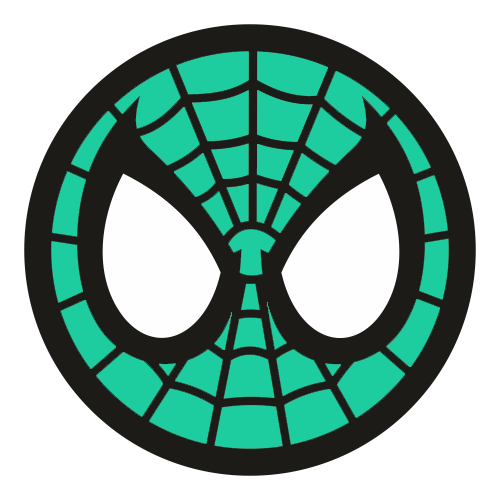
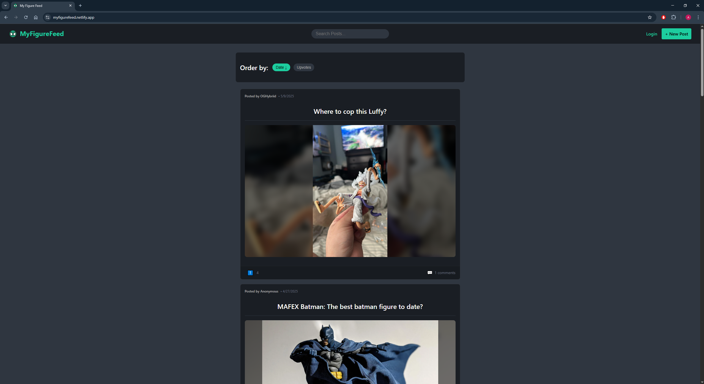

    

  

<h1 align="left">👋 Hi, I'm Alec!</h1>

###

<h3 align="left">Computer Science Major (B.A.) |  Minor in AI | Florida Atlantic University</h3>

###

I'm a driven undergrad at Florida Atlantic University with hands-on experience building full-stack applications and AI solutions. I love turning ideas into functional user-centric products, whether it's a Reddit-style discussion platform, an AI-powered tech support bot, or an automated discord server admin! I have experience creating websites for 20+ artists globally across North America, Europe, and Australia through the Art NXT Level.

###

###

<h2 align="left">🖥 My Most Used Technologies:</h2>

###

<h6 align="left">Languages</h6>

###

  
  
  
  
  
  
  
  
  

###

<h6 align="left">Hosting/SaaS</h6>

###

###

  
  
  

###

<h6 align="left">Frameworks, Platforms, & Libraries</h6>

###

  
  
  
  
  

###

<h6 align="left">Databases</h6>

###

  
  
  

###

<h6 align="left">ML/DL</h6>

###

  
  
  
  
  

###

<h6 align="left">VCS</h6>

###

  
  
  

###

<h2 align="left">🖥 Recent Project :  MyFigureFeed</h2>

###

  

###

 <a href="https://myfigurefeed.netlify.app/" target="blank"> MyFigureFeed</a> is an interactive discussion board focused on sharing user's love and excitement for Action Figures across all categories! Users can post, upvote, and comment as they interact with the community and engage in discussion surrounding new releases, figure showcases, and more. This app implements Vite and ReactJS to create an engaging and clean UI designed to put full focus on posts and user engagement. The backend database is powered by supabase, and the app is hosted by Netlify.

###

<h2 align="left">💡 Current Focus:</h2>

###

- 🚀 Leveling up my full-stack skills (React, Vite, Supabase, Node.js).
- 🧠 Exploring AI/ML applications (TensorFlow, Scikit-learn, OpenAI API).
- 🎨 Designing scalable backends and intuitive UIs.

###

<h2 align="left">📊 My Stats:</h2>

###

  
  

###

<h2 align="left">📩 Let's Connect:</h2>

###

  

###